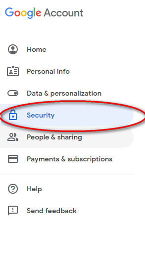
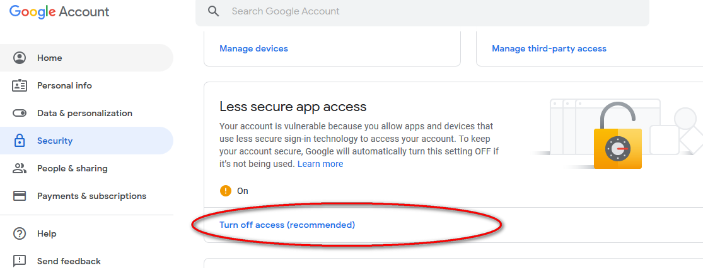
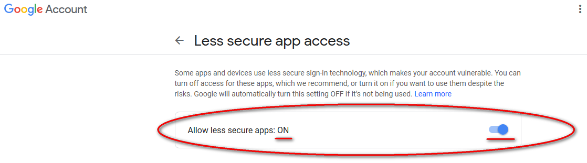
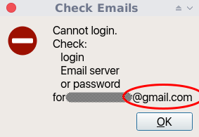

# What is CheckEmail

Thanks you've chosen CheckEmail.

CheckEmail has been written on [Python] with usage [PyQt5].

The main purpose to write this program is to get a lightweight program for monitoring new Emails and avoid running heavyweight Email clients.

CheckEmail can start with OS and be in the system tray just doing it was created for.

The program was created for myself and a mate of mine.
Sharing CheckEmail I hope it'll be helpful for someone else.

CheckEmail supports Emails:

- Gmail
- Yandex
- mailru
- rambler

CheckEmail was tested:

- Debian 9 x64 (Xfce4)
- Windows 10 x64

## Installation

- Download the archive for you OS:

  [CheckEmail_lin64_portable.zip]

  [CheckEmail_win64_portable.zip]

  [CheckEmail_win32_portable.zip]

  [CheckEmail_src.zip]

- Unzip the archive.
- Move unziped folder where you want to start the program.
- Run the program double click the execution file.

## Usage

Add your Emails and customize settings in the main window of program.

> ### *Warrning!*
>
> **You have to enter your Emails fully (e.g. username@gmail.com)**

### If you use Gmail

> If you want the program to check Emails on your Gmail account
> you have to login you Gmail account in a browser
> and turn on less secure app access.
>
> ***Step by step guide:***
>
> Login your Gmail account in a browser.
> Choose Security.
> 
>
> Choose Less secure app access.
>
> 
>
> Turn on Allow less secure app.
>
> 
>
> If you got this message
>
> 
>
> but your login and password are correct.
> Probably you have less secure app access turned off in your Gmail account.

#### Management

- right button click on the icon in the system tray shows context menu;
- middle button click on the icon in the system tray shows main window;
- left button click on the icon in the system tray shows result dialog of checking Emails;
- left button click at any Email in the result dialog invokes default browser (**supporting browsers: Mozilla Firefox, Opera and Google Chrome**)
and program authorises on the chosen Email account (for rambler not implemented yet - not necessary for me now).

## Lisense

**[GNU GPL]**

## Author

Copyright (C) 2019, Alexander Kostuchkov

alkostuchkov@gmail.com

## *Done is better than perfect*

[//]: # (These are reference links used in the body of this note and get stripped out when the markdown processor does its job. There is no need to format nicely because it shouldn't be seen. Thanks SO - http://stackoverflow.com/questions/4823468/store-comments-in-markdown-syntax)

   [CheckEmail_lin64_portable.zip]: <https://github.com/alkostuchkov/CheckEmail/blob/master/Downloads/executables/CheckEmail_lin64_portable.zip>
   [CheckEmail_win64_portable.zip]: <https://github.com/alkostuchkov/CheckEmail/blob/master/Downloads/executables/CheckEmail_win64_portable.zip>
   [CheckEmail_win32_portable.zip]: <https://github.com/alkostuchkov/CheckEmail/blob/master/Downloads/executables/CheckEmail_win32_portable.zip>
   [CheckEmail_src.zip]: <https://github.com/alkostuchkov/CheckEmail/blob/master/Downloads/src/src.zip>
   [GNU GPL]: <https://www.gnu.org/licenses/>
   [Python]: <https://www.python.org/>
   [PyQt5]: <https://riverbankcomputing.com/software/pyqt/intro>
