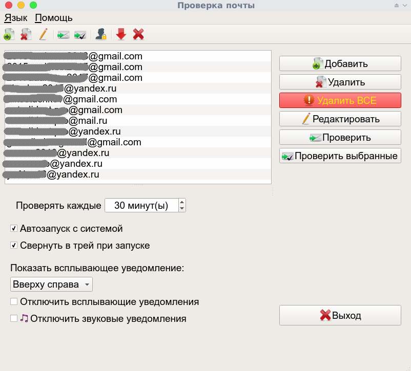
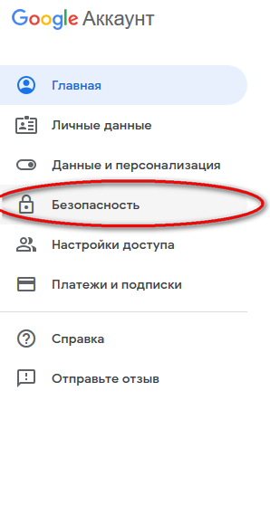
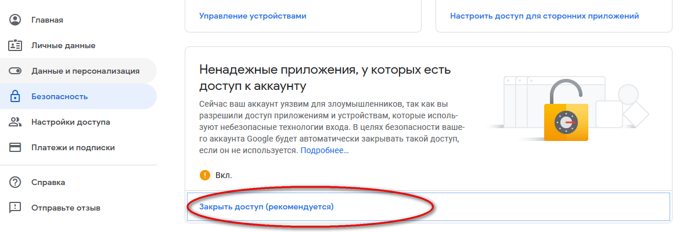
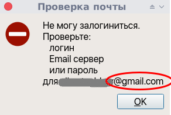

# Что такое CheckEmail 

Спасибо, что выбрали CheckEmail.

CheckEmail написана на [Python] c использованием [PyQt5].

Главное окно программы:

Главной целью написания данной программы было получить легковесную программу для мониторинга новых Emails, исключая необходимость запуска тяжеловесных почтовых программ.

Программа может запускаться вместе с системой и находится в системном трее, просто выполняя свою работу.

Программа была написана для себя и моего товарища.
Выкладывая программу в общий доступ, я надеюсь, что она кому-нибудь также окажется полезной.

Программа поддерживает почтовые ящики:

- Gmail
- Yandex
- mailru
- rambler

CheckEmail тестировалась на:

- Debian 9 x64 (Xfce4, MATE)
- Windows 10 x64

## Установка

- Скачайте архив соответствующий Вашей операционной системе и разрядности:

    [CheckEmail_lin64_portable.zip]

    [CheckEmail_win64_portable.zip]

    [CheckEmail_win32_portable.zip]

    [CheckEmail_src.zip]

- Распакуйте архив.
- Переместите распакованную программу в директорию,
откуда Вы хотите запускать программу.
- Запустите программу дважды кликнув по исполняемому файлу.

## Использование

Добавьте Ваши Emails и выставьте интуитивно понятные настройки в основном окне программы.

> ### *Внимание!*
>
> **Email должен быть введен полностью, например: username@gmail.com**

### Если Вы используете Gmail

> Чтобы программа смогла проверить почту Gmail,
> нужно зайти в свой аккаунт Gmail в любом браузере
> и разрешить доступ для небезопасных приложений.
>
> ***Пошаговая инструкция:***
>
> Войдите в свой Gmail аккаунт в любом браузере.
> Выберите Безопасность.
> 
>
> Выберите Ненадежные приложения, у которых есть
> доступ к аккаунту.
> 
>
> Включите небезопасные приложения.
> 
>
> Если Вы получили следующее уведомление,
>
> 
>
> а логин и пароль верные, то, вероятно,
> у Вас запрещен доступ для небезопасных приложений в Вашем аккаунте Gmail.

#### Основное управление

- клик правой кнопкой мыши по значку программы в трее
вызывает контекстное меню;
- клик средней кнопкой мыши по значку программы в трее открывает главное окно программы;
- одинарный клик левой кнопкой мыши по значку программы в трее открывает диалоговое окно с результатами проверки почтовых ящиков;
- одинарный клик левой кнопкой мыши в диалоговом окне с результатами проверки по любому Email вызывает браузер по умолчанию (**поддерживаются браузеры: Mozilla Firefox, Opera и Google Chrome**) и происходит автоматическая авторизация на выбранном почтовом сервере (для почтового сервера rambler авторизация еще не реализована - пока не было необходимости).

## Лицензия

**[GNU GPL]**

## Автор

Copyright (C) 2019, Александр Костючков

alkostuchkov@gmail.com

## *Сделанное лучше идеального*

[//]: # (These are reference links used in the body of this note and get stripped out when the markdown processor does its job. There is no need to format nicely because it shouldn't be seen. Thanks SO - http://stackoverflow.com/questions/4823468/store-comments-in-markdown-syntax)

   [CheckEmail_lin64_portable.zip]: <https://github.com/alkostuchkov/CheckEmail/blob/master/Downloads/executables/CheckEmail_lin64_portable.zip>
   [CheckEmail_win64_portable.zip]: <https://github.com/alkostuchkov/CheckEmail/blob/master/Downloads/executables/CheckEmail_win64_portable.zip>
   [CheckEmail_win32_portable.zip]: <https://github.com/alkostuchkov/CheckEmail/blob/master/Downloads/executables/CheckEmail_win32_portable.zip>
   [CheckEmail_src.zip]: <https://github.com/alkostuchkov/CheckEmail/blob/master/Downloads/src/src.zip>
   [GNU GPL]: <https://www.gnu.org/licenses/>
   [Python]: <https://www.python.org/>
   [PyQt5]: <https://riverbankcomputing.com/software/pyqt/intro>
